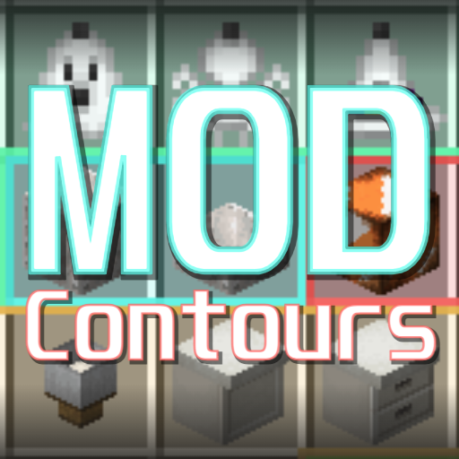

# 🎨 Mod Contours

**Mod Contours** — это клиентский мод для Minecraft Forge, который помогает навести порядок в инвентаре, визуально группируя предметы из одного мода с помощью цветных динамических рамок. Если вы устали теряться в инвентаре с сотнями предметов из разных модов, Mod Contours создан для вас!

## ✨ Демонстрация

## 🚀 Особенности

*   **Динамические контуры**: Предметы из одного мода автоматически объединяются общим цветным контуром.
*   **Умное определение**: Мод сам определяет, к какому моду принадлежит предмет.
*   **Высокая производительность**: Минимальное влияние на производительность игры.
*   **Полная настройка**: Вы можете настроить толщину линий, прозрачность заливки и стиль контуров через конфигурационный файл.
*   **Многоязычность**: Интерфейс и описание переведены на множество языков.

## 📦 Установка

1.  Убедитесь, что у вас установлен [Minecraft Forge](https://files.minecraftforge.net/net/minecraftforge/forge/).
2.  Скачайте последнюю версию мода:
    *   [Релизы на GitHub](https://github.com/mrdiovkrad/ModContours/releases)
    *   [Modrinth](https://modrinth.com/mod/modcontours) *(Скоро)*
    *   [CurseForge](https://www.curseforge.com/minecraft/mc-mods/modcontours) *(Скоро)*
3.  Поместите скачанный `.jar` файл в папку `mods` в вашей директории Minecraft.
4.  Запустите игру и наслаждайтесь!

## ⚙️ Настройка

Все настройки мода можно изменить через меню конфигурации модов в игре. Вы можете настроить:
*   Толщину линии
*   Прозрачность заливки
*   Стиль линии
*   И другие параметры для идеального отображения!

## 🌍 Поддерживаемые языки

*   English
*   Русский
*   Deutsch
*   Español
*   Français
*   中文 (简体)
*   日本語
*   Português (Brasil)
*   Polski
*   한국어

---
*Разработано APPLYOK | Автор: MrDioVkrad*
[applyok.ru](https://applyok.ru)
